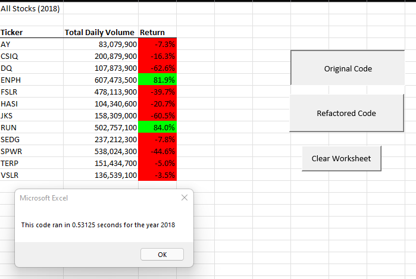
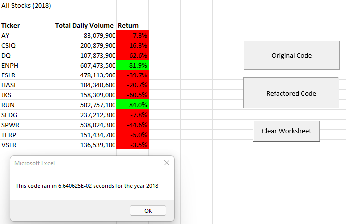

# Green-Stocks

## Overview
This analysis was created to track trading volume and prices for 12 stocks of interest.
The macro tool loops through each ticker, collecting it's start price, end price, and volume then displaying it on a new page.

## Results

I added a macro button for the original code and another button to clear the output.

Then I refactored the code to loop through the tickers and input into arrays to store the data. Final data output for the refactor is all at once. This greatly increased the speed of the code running.

The old code ran in good time, outputting accurate data in a little over half a second.

The refactored code for both years ran at hundredths of a second as opposed to tenths. That is an order of magnitude in improvement.

Clearly, refactoring can yield good results in terms of clearing up code, making it more readable, or allowing it to run faster.